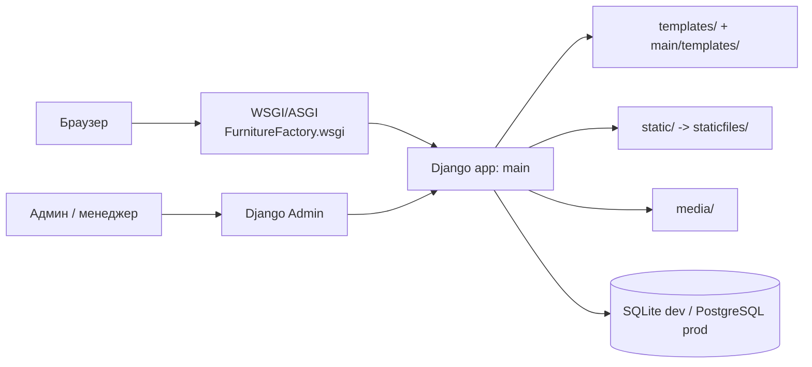

# FurnitureFactorySite

Сайт мебельной фабрики.

Сайт включает каталог продукции, приём заявок и управление контентом через админку.

## Назначение

Проект решает задачи:
- публикация каталога мебели (модели, категории, фото, характеристики);
- приём заказов от клиентов;
- расчет стоимости и оформление заказа;
- возможность оставить отзыв для клиентов;
- управление контентом и заявками через Django admin.

## Целевые пользователи

- **Клиенты** — просматривают каталог, оставляют заявки на заказ.
- **Сотрудники фабрики** — обрабатывают заявки, редактируют каталог через админку.
- **Администратор** — управляет пользователями, правами, настройками сайта.

## Стек технологий

| Слой | Технология |
|---|---|
| Язык | Python 3.14.17 |
| Фреймворк | Django 5.2.14|
| СУБД (dev) | SQLite (`db.sqlite3`) |
| СУБД (prod) | PostgreSQL (Render) |
| Статика | Django staticfiles + WhiteNoise / Nginx |
| Медиа | Локальная папка `media/` |
| Контейнеризация | Docker, docker-compose |
| Деплой | Render (`render.yaml`, `build.sh`) |

## Архитектура



- **`FurnitureFactory/`** — конфигурация проекта: settings, urls, wsgi/asgi.
- **`main/`** — приложение с бизнес-логикой (модели, представления, формы, admin).
- **`templates/`** и **`main/templates/`** — HTML-шаблоны (общие и приложения).
- **`static/`** — исходная статика; **`staticfiles/`** — собранная (`collectstatic`) для прод-раздачи.
- **`media/`** — загруженные пользователями файлы (фото мебели и т.п.).

## Модули проекта

| Модуль | Ответственность |
|---|---|
| `FurnitureFactory/settings.py` | Настройки, подключение БД, статики, media, приложений. |
| `FurnitureFactory/urls.py` | Корневая маршрутизация, подключение `main.urls` и admin. |
| `FurnitureFactory/wsgi.py` / `asgi.py` | Точки входа для WSGI/ASGI-серверов. |
| `main/models.py` | Модели данных: Product, Order и т.д.|
| `main/views.py` | Представления: каталог, карточка товара, страница формы заявки. |
| `main/forms.py` | Формы (заявка, отзыв, регистрация клиента). |
| `main/admin.py` | Регистрация моделей в админке, настройка отображения. |
| `main/management/` | Кастомные management-команды (`python manage.py <команда>`). |
| `main/tests/` | Тесты приложения. |
| `main/migrations/` | Миграции схемы БД. |

## Точки интеграции

- **БД:** SQLite в dev (`db.sqlite3`), PostgreSQL в prod (Render).
- **Файловая система:**
  - `media/` — пользовательские загрузки;
  - `static/` → `staticfiles/` — статика после `collectstatic`.
- **Внешние сервисы:** 
  **Weather API** — получение текущей погоды в Минске через WeatherAPI.
  - **YouTube Data API v3** — получение последнего видео с канала Vitra.
- **Деплой:** Render (`render.yaml` + `build.sh`), Docker (`Dockerfile`, `docker-compose.yml`).
- **Логи:** `debug.log` (в репозиторий не коммитить).

## Запуск проекта

### Требования

- Python 3.14.17
- pip / venv
- (опционально) Docker и docker-compose

### 1. Клонирование и окружение

```bash
git clone <repo_url>
cd FurnitureFactorySite

python -m venv .venv
source .venv/bin/activate        # Windows: .venv\Scripts\activate
pip install -r requirements.txt
```

### 2. Переменные окружения

Создайте `.env` рядом с `manage.py`:

```env
DJANGO_SECRET_KEY=change-me
DJANGO_DEBUG=True
DJANGO_ALLOWED_HOSTS=localhost,127.0.0.1

# Внешние API
YOUTUBE_API_KEY=AIzaSy...ваш_ключ...
YOUTUBE_CHANNEL_ID=UCRrX7JDhqmJVbHQ2wun78Gw
OPENWEATHER_API_KEY=ваш_ключ_openweathermap

# Прод (Render / PostgreSQL) — заполняется на стороне хостинга
DATABASE_URL=
```

### 3. Миграции и суперпользователь

```bash
python manage.py migrate
python manage.py createsuperuser
```

### 4. Запуск

```bash
python manage.py runserver
```

- Сайт: http://127.0.0.1:8000/
- Админка: http://127.0.0.1:8000/admin/

### 5. Через Docker

```bash
docker compose up --build
```

### 6. Деплой на Render

- Сборка выполняется через `build.sh`.
- Параметры сервиса описаны в `render.yaml`.

### Тесты

```bash
python manage.py test
```

## Документация

- [Спецификация требований](docs/requirements.md)
- [Реестр дефектов](docs/ISSUES.md)
- [Диаграмма состояний Order](docs/state_diagram.md)