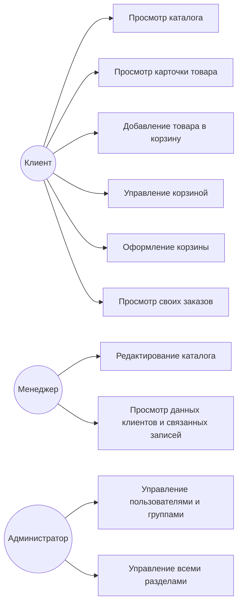

# Спецификация требований — FurnitureFactorySite

**Версия:** 1.0
**Дата:** 2026-10-01
**Автор:** <ФИО, группа>

---

## 1. Бизнес-требования

### 1.1. Назначение системы

FurnitureFactorySite — веб-сайт мебельной фабрики, публикующий каталог продукции,
принимающий заявки от клиентов и предоставляющий сотрудникам и администратору
инструменты управления контентом и обращениями.

### 1.2. Проблема

У фабрики нет собственного онлайн-представительства. Клиенты вынуждены звонить
или писать в мессенджеры, чтобы узнать ассортимент и цены. Менеджеры тратят
время на одни и те же вопросы. Нет единого места, где каталог актуален и
доступен 24/7.

### 1.3. Цели

| ID | Цель | Метрика |
|---|---|---|
| BG-1 | Круглосуточный доступ клиентов к каталогу | Каталог доступен без авторизации 24/7 |
| BG-2 | Единая точка сбора заявок | Все заявки попадают в админку без потерь |
| BG-3 | Снижение нагрузки на менеджеров | Автоматическое оформление заказов |
| BG-4 | Повышение доверия через актуальные медиа | Погода и видео обновляются на главной |

---

## 2. Пользовательские требования (Use Cases)

### Диаграмма вариантов использования

### Перечень вариантов использования

| ID | Название | Актор |
|---|---|---|
| UR-1 | Просмотр каталога | Клиент |
| UR-2 | Просмотр карточки товара | Клиент |
| UR-3 | Добавление товара в корзину | Клиент |
| UR-4 | Управление корзиной | Клиент |
| UR-5 | Оформление корзины | Клиент |
| UR-6 | Просмотр своих заказов | Клиент |
| UR-7 | Редактирование каталога | Менеджер |
| UR-8 | Просмотр данных клиентов и связанных записей | Менеджер |
| UR-9 | Управление пользователями и группами | Администратор |
| UR-10 | Управление всеми разделами | Администратор |

---

## 3. Функциональные требования

| ID | Требование |
|---|---|
| FR-1 | Система отображает список категорий мебели на отдельной вкладке |
| FR-2 | Система сортирует список товаров по возрастанию/убыванию |
| FR-3 | Система открывает карточку товара при клике на название в каталоге |
| FR-4 | Карточка товара содержит фото, название, описание, цену |
| FR-5 | В карточке товара пользователь может добавить модель в корзину |
| FR-6 | При добавлении в корзину создаётся позиция с количеством 1 |
| FR-7 | На странице корзины пользователь может изменить количество позиции |
| FR-8 | На странице корзины пользователь может удалить позицию |
| FR-9 | Ссылки на корзину и список заказов доступны из главного меню |
| FR-10 | При оформлении корзины каждая позиция превращается в заказ, дата доставки устанавливается автоматически (+7 дней от даты заказа) |
| FR-11 | После оформления открывается страница со списком заказов клиента |
| FR-12 | Список заказов содержит: Order ID, Furniture, Quantity, Order Date, Delivery Date, Total Price, Status |
| FR-13 | Менеджер имеет доступ на просмотр (без права изменения) к моделям Client, Cart, CartItem, Review, PromoCode |
| FR-14 | Менеджер может просматривать, фильтровать заказы и менять их статус в админке |
| FR-15 | Менеджер может создавать и редактировать товары, типы мебели и дизайны (Furniture, Type, Design) |
| FR-16 | Админка доступна только пользователям с `is_staff=True`, права разграничиваются через группы Django |
| FR-17 | Система отображает текущую погоду через OpenWeatherMap API и последнее видео с YouTube-канала фабрики |

---

## 4. Нефункциональные требования

| ID | Требование | Категория |
|---|---|---|
| NFR-1 | Страница каталога загружается не дольше 2 сек при 100 товарах | Производительность |
| NFR-2 | Сайт работает в Chrome, Firefox, Safari последних версий | Совместимость |
| NFR-3 | `.env` не попадает в репозиторий; секреты не логируются | Безопасность |
| NFR-4 | Персональные данные клиентов видны только staff-пользователям | Безопасность |
| NFR-5 | Страницы содержат корректный `viewport`-метатег для мобильных устройств | Usability |
| NFR-6 | При недоступности OpenWeatherMap или YouTube соответствующий виджет скрывается, страница продолжает работать | Отказоустойчивость |
| NFR-7 | Система ведёт лог в файл и консоль через стандартный модуль `logging` | Сопровождаемость |

---

## 5. Верификация требований

| ID | Способ проверки | Критерий |
|---|---|---|
| BG-1 | Открыть каталог без авторизации в разное время суток | Каталог доступен |
| BG-2 | Оформить 5 заказов, проверить в админке | Все 5 сохранены |
| BG-3 | Оформить корзину клиентом, проверить, что заказ создан без участия менеджера | Заказ создаётся автоматически, менеджер не задействован |
| BG-4 | Открыть главную | Погода и видео отображаются |
| UR-1 | Открыть вкладку каталога | Отображаются дизайны, типы мебели и список моделей |
| UR-2 | Открыть карточку товара из каталога | Фото, название, описание, цена |
| UR-3 | В карточке нажать «В корзину» | Позиция добавлена |
| UR-4 | В корзине изменить количество / удалить позицию | Значения обновляются |
| UR-5 | Нажать «Оформить» в корзине | Заказы созданы |
| UR-6 | Открыть «Мои заказы» | Таблица заказов клиента |
| UR-7 | Войти менеджером, открыть каталог в админке, добавить товар | Товар виден на сайте |
| UR-8 | Войти менеджером, открыть Client/Cart/Review/PromoCode | Разделы открываются только на чтение |
| UR-9 | Создать пользователя, назначить группу | Доступ ограничен правами группы |
| UR-10 | Войти админом | Все разделы доступны |
| FR-1 | Открыть вкладку каталога | Список категорий отрендерен |
| FR-2 | Применить сортировку по цене/названию | Список переупорядочен |
| FR-3 | Кликнуть название товара в каталоге | Открылась карточка |
| FR-4 | Открыть карточку | Все 4 поля присутствуют |
| FR-5 | Нажать «В корзину» в карточке | Позиция в корзине |
| FR-6 | Добавить товар, открыть корзину | Количество = 1 |
| FR-7 | Изменить количество в корзине | Значение обновлено, сумма пересчитана |
| FR-8 | Удалить позицию из корзины | Позиция исчезла |
| FR-9 | Открыть главное меню | Ссылки «Корзина» и «Заказы» присутствуют |
| FR-10 | Оформить корзину | Delivery Date = Order Date + 7 дней |
| FR-11 | После оформления | Открылась страница со списком заказов |
| FR-12 | Открыть страницу заказов | 7 колонок: Order ID, Furniture, Quantity, Order Date, Delivery Date, Total Price, Status |
| FR-13 | Войти менеджером, открыть Client/Cart/CartItem/Review/PromoCode | Разделы открываются без кнопок Save/Delete |
| FR-14 | Войти менеджером, открыть Orders, применить фильтр, изменить статус | Список отфильтрован; статус сохранён |
| FR-15 | Войти менеджером, добавить/отредактировать Furniture, Type, Design | Изменения сохранены и видны на сайте |
| FR-16 | Войти staff, открыть `/admin/` | Недоступные разделы скрыты |
| FR-17 | Открыть главную с валидными ключами | Погода и последнее видео показаны |
| NFR-1 | `curl -w "%{time_total}" http://127.0.0.1:8000/` | < 2 сек |
| NFR-2 | Открыть в Chrome, Firefox, Safari | Везде работает без ошибок |
| NFR-3 | `git ls-files \| grep .env` | Пусто |
| NFR-4 | Открыть `/admin/` без авторизации | Показана страница входа Django для staff-пользователей; разделы недоступны |
| NFR-5 | Открыть исходник HTML | Присутствует `<meta name="viewport">` |
| NFR-6 | Убрать ключ API, обновить главную | Виджет скрыт, страница 200 OK |
| NFR-7 | Открыть `debug.log` после запроса | В файле есть записи |

---

## 6. Результаты сверки с приложением

Сверка проведена 2026-10-01. Выявленные расхождения зарегистрированы
и устранены — см. `docs/ISSUES.md`.

| ID | Статус | Комментарий |
|---|---|---|
| BG-1…BG-4 | ✅ | Бизнес-цели достигаются |
| UR-1…UR-10 | ✅ | Все сценарии реализованы |
| FR-1…FR-12 | ✅ | Реализовано |
| FR-13 | ✅ | Права группы employee на просмотр Client/Cart/CartItem/Review/PromoCode настроены |
| FR-14 | ✅ | Фильтрация заказов и смена статуса в админке работают |
| FR-15 | ✅ | Редактирование каталога менеджером работает |
| FR-16 | ✅ | Группы Django используются |
| FR-17 | ✅ | Интеграции работают, ошибка виджета устранена (ISSUE-1, ISSUE-3) |
| NFR-1…NFR-2 | ✅ | Проверено |
| NFR-3 | ✅ | `.env` в `.gitignore` |
| NFR-4 | ✅ | Разделы админки доступны только staff-пользователям |
| NFR-5 | ✅ | `viewport`-метатег присутствует |
| NFR-6 | ✅ | Виджеты скрываются при ошибке API |
| NFR-7 | ✅ | Логирование настроено и работает |

**Итог:** все требования подтверждены работающим приложением.
Открытых расхождений нет — все дефекты в `docs/ISSUES.md` имеют
статус `RESOLVED`.