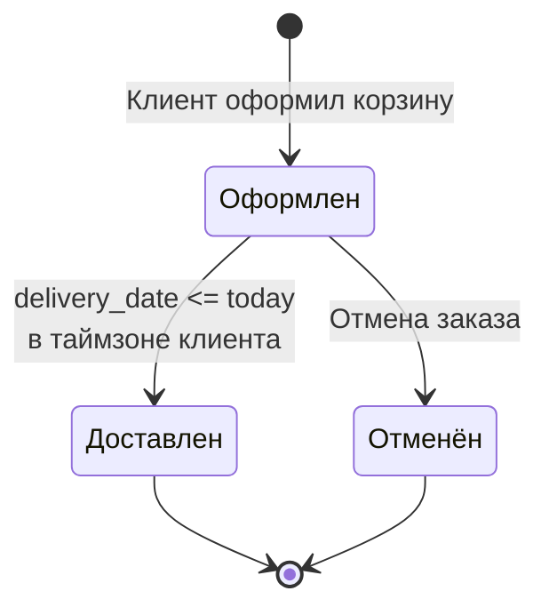

# Диаграмма состояний — Order

## Сущность

**Order (Заказ)** — создаётся при оформлении корзины клиентом.
Жизненный цикл управляется полем `status` модели `main.models.Order`.

## Диаграмма состояний

## Состояния

| Состояние | Значение в БД | Описание | Тип |
|---|---|---|---|
| **Оформлен** | `new` | Заказ создан; дата доставки в будущем | Начальное |
| **Доставлен** | `delivered` | Наступила `delivery_date` в таймзоне клиента | Конечное |
| **Отменён** | `cancelled` | Заказ отменён до даты доставки | Конечное |

**Начальное состояние:** Оформлен
**Конечные состояния:** Доставлен, Отменён

## Переходы

| Из | В | Событие | Условие (guard) |
|---|---|---|---|
| `[*]` | Оформлен | Оформление корзины | Корзина не пуста |
| Оформлен | Доставлен | Наступление даты доставки | `delivery_date <= today` в таймзоне клиента |
| Оформлен | Отменён | Отмена заказа | `status == 'new'` |
| Доставлен | `[*]` | — | — |
| Отменён | `[*]` | — | — |